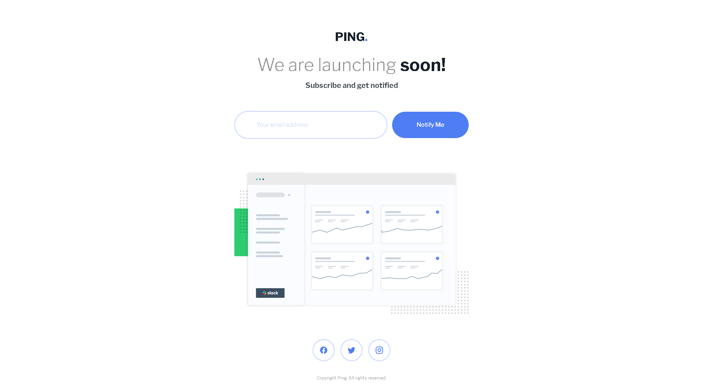

# Frontend Mentor - Ping coming soon page solution

This is a solution to the [Ping coming soon page challenge on Frontend Mentor](https://www.frontendmentor.io/challenges/ping-single-column-coming-soon-page-5cadd051fec04111f7b848da). Frontend Mentor challenges help you improve your coding skills by building realistic projects.

## Table of contents

- [Overview](#overview)
  - [The challenge](#the-challenge)
  - [Screenshot](#screenshot)
  - [Links](#links)
  - [Built with](#built-with)
  - [What I learned](#what-i-learned)
- [Author](#author)

## Overview

### The challenge

Users should be able to:

- View the optimal layout for the interface depending on their device's screen size
- See hover and focus states for all interactive elements on the page

### Screenshot

### Links

- Live Site URL: [live site URL here](https://storied-brioche-ae7f3c.netlify.app/)
- Github URL: [Git](https://github.com/Sittisukintaruk/Frontend-Mentor---Ping-coming-soon-page-solution)

### Built with

- Semantic HTML5 markup
- CSS custom properties
- Flexbox
- CSS Grid
- Tailwind

### What I learned

กลับมาเริ่มทำโปรเจต เป้าหมายคือ 1000 แต้มใน Frontend mentor

## What problem in project

- naming css class

## Author

- Frontend Mentor - [@Sitthisak Intharak](https://www.frontendmentor.io/profile/Sittisukintaruk)
